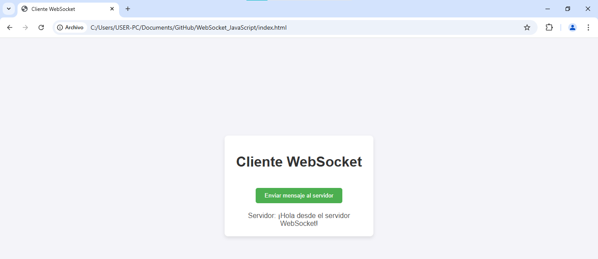
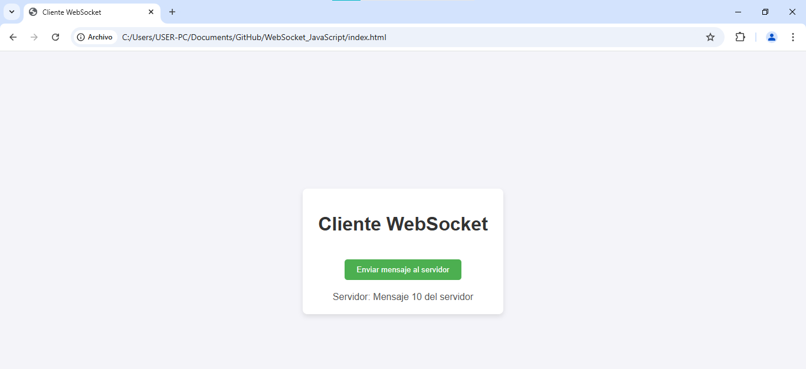
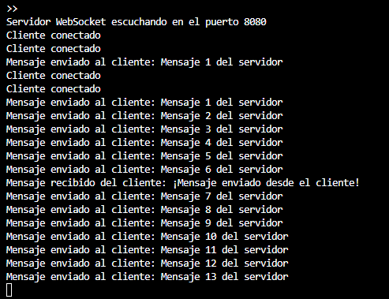

# 🌐 WebSocket Example: JavaScript

This project is a basic application that uses **WebSocket** in **Node.js** to establish a two-way communication between the server and the client. The goal is to demonstrate how WebSocket allows a persistent connection to be maintained, allowing the server to send periodic messages to the client without requiring a new request.

### Browser




### WebSocket Server


---

## 🚀 **Technologies Used**  
- **Backend**: Node.js, WebSocket
- **Server**: WebSocket Server with Node.js
- **Frontend**: HTML, JavaScript

---

## 📖 **Prerequisites**  
Before running this project, ensure you have the following components installed:
1. **Node.js** (Recommended version: 16 or higher)
2. **Git**
3. A text editor like **Visual Studio Code** (optional). 

---

## 🛠️ **Steps to Set Up and Run the Project**  

### 1️⃣ Clone the Repository  
Use the following command to clone the project from GitHub:  
```
git clone https://github.com/ciizao/WebSocket_JavaScript.git
```
### 2️⃣ Navigate to the Project Directory
Go to the project directory with the following command:
 ```
cd  WebSocket_JavaScript
```
### 3️⃣ Initialize the Node.js Project
If the `package.json` file hasn't been created yet, run the following command to initialize the project:
`npm init -y`

### 4️⃣ Install Dependencies
Install the necessary dependencies by running the following command:
 ```
npm install ws
```
- This will install the **`ws`** library, which is used to create the WebSocket server in Node.js.

### 5️⃣  Run the Server
Start the WebSocket server by running the following command:
 ```
node server.js
```
- WebSocket server is listening on port `8080`

### 6️⃣ Open the Client
Open the **`index.html`** file in your browser. This file contains the client-side code that connects to the WebSocket server.

### 7️⃣  Look Communication
- Once the client connects to the server, the console and the browser will display a successful connection message. And a message from the client on the server.

- Also, in the browser interface, you will see messages sent from the server, such as:
`Message 1 from the server Message 2 from the server`

- *The server sends a new message every 30 seconds, with an incremented counter, to demonstrate the persistent connection.


## 📂 Repository
* The source code for this project is available on GitHub:

```
https://github.com/ciizao/WebSocket_JavaScript.git
```